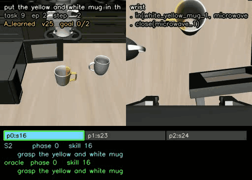

# A Dual-System VLA policy on LIBERO-Long

A robot manipulation policy split into two parts that run at different speeds:

- **System 2** looks at the scene and decides *which step of the task we are on*.
  Small (about 162k weights), and it re-decides every single control step.
- **System 1** is an Action Chunking Transformer (ACT) that produces the actual
  arm movements (about 51.6M weights), conditioned on System 2's answer.

Evaluated on **LIBERO-Long** (`libero_10`), the ten long-horizon tasks, using the
Hugging Face LeRobot ecosystem.

This README is a setup guide: how to run the code, download the dataset slice, and
execute the evaluation. The full report (results, methods, and discussion) is in
[`short_report/mortez_report_dual_system.pdf`](short_report/mortez_report_dual_system.pdf).
Sample result videos are in
[`sample_videos.md`](sample_videos.md).

## Sample result

Below is one sample successful rollout, with System 2's choice drawn on every
frame (task 9, episode 2, success in 268 steps):



More clips and per-step traces are in
[`sample_videos.md`](sample_videos.md).

---

## Requirements

A CUDA GPU. Tested on an Nvidia RTX cards (driver 550 on Ubunti 22.04 and 24.04).

Two ways to run this. **Docker is the easier one** and is what I used for every
number in the report. Native works fine but you have to get the CUDA and EGL
pieces right yourself.

---

## Dataset

The dataset slice is `lerobot/libero`, pinned to the `libero_10` tasks only, at
revision `a1aaacb7f6cd6ee5fb43120f673cebb0cfea7dd4` (about 1.9 GB). It is pinned so
every run, and every condition within a run, sees the same revision; a silently
changed dataset would produce differences that look architectural and are not.

It downloads automatically on first use, when `scripts/02_label_dataset.py` or a
training script first loads it. The cache is at `~/.cache/huggingface` by default.
Under Docker, set `HF_CACHE` to move it:

```bash
export HF_CACHE=/path/to/cache
```

The per-frame training labels are **not** part of the dataset; they are derived
from it by `scripts/02_label_dataset.py` and written to
`outputs/subgoal_labels.parquet` the first time you run the prepare step.

---

# Native

[I really recommend using Docker setup though, which you can find after this section.]

## Native: setup

```bash
git clone <this repository>
cd <this repository>

python3.12 -m venv .venv
source .venv/bin/activate

# torch first, from PyTorch's own index, matching your CUDA version
pip install torch torchvision --index-url https://download.pytorch.org/whl/cu128

pip install -r requirements.txt
pip install -e ./policy          # the policy, as a LeRobot plugin
```

Then set the rendering mode **in your shell**:

```bash
export MUJOCO_GL=egl
```

This one matters. MuJoCo reads that variable when it is imported, so it has to be
set before Python starts. Setting it inside a script does nothing at all, and the
failure turns up much later as blank images rather than as an error.

You also need the EGL system libraries, which is the part that usually bites on a
fresh machine:

```bash
sudo apt-get install -y libglvnd0 libgl1 libglx0 libegl1 libgles2 libosmesa6
```

Check it all works before going further:

```bash
python scripts/00_check_setup.py
```

Five checks: rendering without a screen, `subgoals.json`, whether LeRobot can
find the policy plugin, whether the two copies of the sub-goal index agree, and
whether a LIBERO task actually runs. Each one prints what to do if it fails.

## Native: run

**1. Prepare the data.** Downloads the dataset slice on first use, derives the
sub-goals and a per-frame phase label for the training split.

```bash
python scripts/01_make_subgoals.py     # instructions -> sub-goals and skills
python scripts/02_label_dataset.py     # a phase label for every training frame
```

Look at the labels before training on them:

```bash
python scripts/02_label_dataset.py --video 3
```

**2. Train.** Three runs, about 4 hours each. Only these three need training; the
other conditions reuse them.

```bash
python scripts/03_train.py A_learned --smoke     # 10 steps first, to check
python scripts/03_train.py A_learned
python scripts/03_train.py B_static
python scripts/03_train.py C_none
```

**3. Evaluate.** This is the ablation study.

```bash
python scripts/05_sweep.py --dry-run     # the plan and a time estimate
python scripts/05_sweep.py               # about 8 hours, resumable
python scripts/07_analyze.py             # intervals and paired tests
```

The sweep skips anything already finished, so it can be stopped and restarted.
Results land in `./outputs/`.

**4. Error recovery and videos.**

```bash
python scripts/06_perturb.py --condition A_learned
python scripts/06_perturb.py --condition A_frozen    # the control
python scripts/08_video.py --condition A_learned
python scripts/08_video.py --condition A_oracle      # only runs this way
```

---

# Docker

The container already has CUDA, EGL, `MUJOCO_GL`, and the LIBERO configuration
set up, so none of the native gotchas apply.

## Docker: setup

Needs Docker with the NVIDIA Container Toolkit, so that `--gpus all` works.

```bash
docker compose build          # about 25 minutes the first time
docker compose run --rm check
```

`check` runs the same five checks as the native path. If it passes, everything
else will work.

Results land in `./outputs/`, which is mounted into the container, so they
survive a rebuild. The dataset cache is mounted too, at `~/.cache/huggingface` by
default; set `HF_CACHE` to move it.

## Docker: run

Same pipeline, one service per step.

```bash
# 1. prepare the data (sub-goals + labels)
docker compose run --rm prepare

# 2. train, about 4 hours each
docker compose run --rm train A_learned
docker compose run --rm train B_static
docker compose run --rm train C_none

# 3. the ablation study
docker compose run --rm sweep --dry-run
docker compose run --rm sweep
docker compose run --rm analyze

# 4. error recovery and videos
docker compose run --rm perturb --condition A_learned
docker compose run --rm video --condition A_learned
docker compose run --rm video --condition A_oracle
```

To poke around inside:

```bash
docker compose run --rm shell
```

For a long unattended run, start it detached and follow the log:

```bash
docker compose run -d --name sweep_job sweep
docker logs -f sweep_job
```

---

## Rollout videos

**Start with [`sample_videos.md`](sample_videos.md).** It walks eleven annotated
clips, as inline GIFs, covering nine of the ten tasks and chosen to show each
thing the ablation has to distinguish: both systems working, System 1 as the
bottleneck, System 2 as the bottleneck (with the oracle run of the same episode
beside it as proof), and two cases where the agreement metric itself is
misleading. Two of the clips are the same task and weights under different seeds,
one failing without ever closing the gripper and one succeeding after dropping
the object twice, which is the bottleneck answer in a single comparison.

Those GIFs are the only clips shipped in the repository. MP4s are not: they are
large, they cannot be embedded in Markdown, and they are cheap to regenerate. Run
`scripts/08_video.py` for the full set (three episodes per task, both conditions),
or name exact episodes with `--pairs 3:4,9:2` to re-render one clip without
running the episodes before it.

`scripts/08_video.py` writes an MP4 per episode into `outputs/videos/`, with two
readouts drawn on every frame, each as a phase, a skill id, and the sub-goal text:

- **what System 2 chose**, and therefore what System 1 was conditioned on
- **what was actually true**, from a ground-truth oracle reading simulator state

A progress bar along the bottom shows both at once: filled box for System 2's
choice, outlined box for the truth, each box labelled with the skill its phase
maps to.

Both integers are drawn because they answer different questions. The **phase** is
where you are inside this task, so it is what System 2 classifies and what makes
"forwards" mean something. The **skill** is what the sub-goal means with task
identity and ordinals merged away, so it is the row of the embedding table and
the only one System 1 ever sees. On task 8 the phases map to skills
`[9, 10, 9, 10]`, so System 2 can name the wrong phase and still hand System 1
the right skill. The overlay gives that case its own colour (amber, between green
for agreement and red for a wrong skill) and the trace records both agreement
rates, because scoring phases alone reports it as a reasoning failure when the
interface was in fact correct.

Having both readouts on screen is what makes the bottleneck question answerable
by eye. Agreement plus failure is an execution problem. Divergence before a
failure is a reasoning problem. Each video is saved with a `.json` file holding
the full per-step trace, so the numbers can be recomputed without re-running
anything.
