# Sample rollouts, with System 2 drawn on every frame

Eleven clips from the shipped system. Every frame carries what System 2 chose,
what was actually true, and the skill id that both resolve to, which is the
integer System 1 is really conditioned on.

All eleven come from one campaign: `A_learned` trained for 100,000 steps on the
25 skill interface, evaluated over 10 episodes on each of the 10 `libero_10`
tasks. Nine of the ten tasks appear; task 0 is absent because it went 0 for 10.

---

## Reading a frame

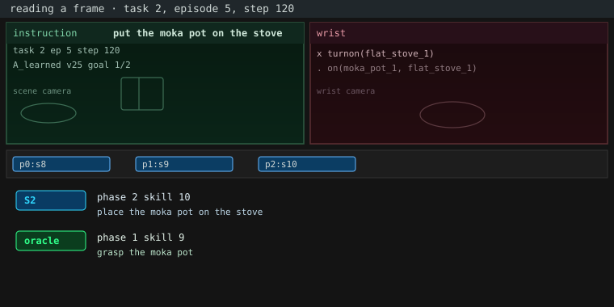

The layout above is task 2, episode 5, step 120. Top left is the scene camera
panel (instruction, task/episode/step, condition, interface, and goal count);
top right is the wrist panel with each goal predicate (`x` satisfied, `.` not).
The footer shows, per phase of this task, a `p<phase>:s<skill>` box, then two
readouts:

| line | what it is |
|---|---|
| `S2` | what System 2 emitted this step — what System 1 was conditioned on |
| `oracle` | what ground truth says the sub-goal should be, from the simulator's BDDL predicates |

Box strip: filled cyan is System 2's choice, green outline is the truth. Oracle
line colour: green = phase and skill both match; amber = label differs but the
skill is the same (System 1 still conditioned correctly); red = the skill
differs (wrong sub-goal).

---

## The clips

### Both systems working

Successes where System 2 tracks the truth, System 1 executes, and the episode
ends early.

- **Task 3, episode 4.** Success in 207 steps.
- **Task 9, episode 2.** Success in 268 steps.
- **Task 6, episode 8.** Success in 212 steps; System 2 and truth agree.
- **Task 1, episode 3.** Success in 273 steps; the channel carries a backward
  transition.

| clip | |
|---|---|
| task 3, episode 4 | 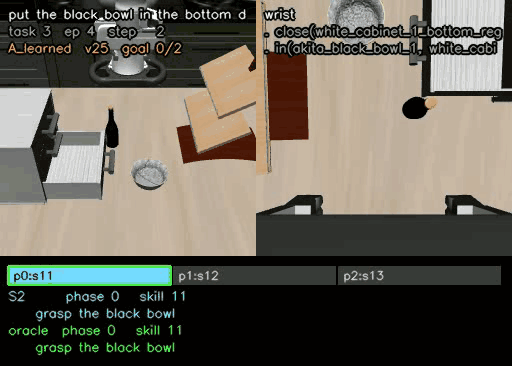 |
| task 9, episode 2 |  |
| task 6, episode 8 | 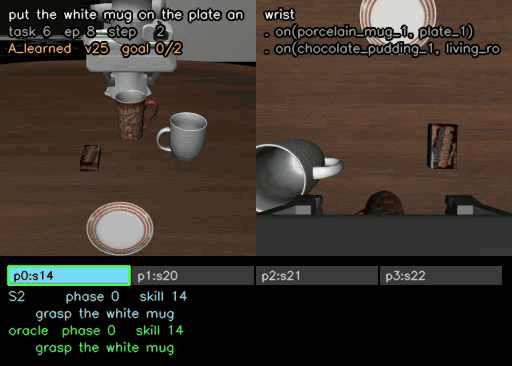 |
| task 1, episode 3 | 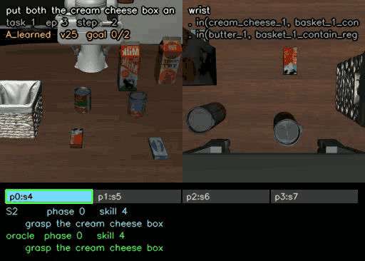 |

### System 1 is the bottleneck

Both readouts agree and the arm still fails, so nothing System 2 could have said
would have helped.

- **Task 7, episode 8.** Failure at the cap; 100% agreement, never progressed.
- **Task 7, episode 2.** Success in 445 steps, same weights, different seed.
- **Task 4, episode 3.** Failure at the cap.

| clip | |
|---|---|
| task 7, episode 8 | 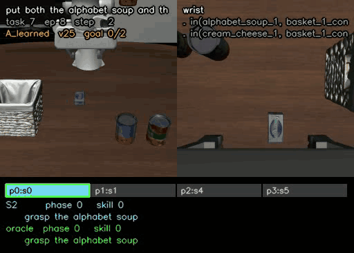 |
| task 7, episode 2 | 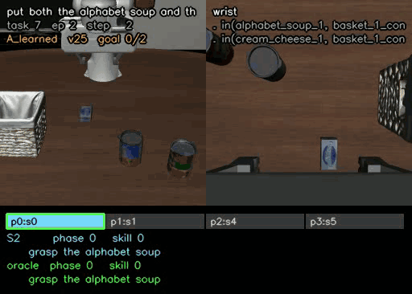 |
| task 4, episode 3 | 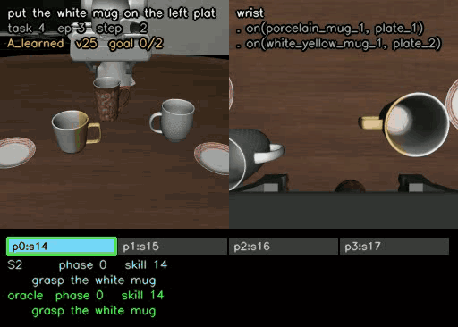 |

### System 2 is the bottleneck, shown by the oracle

The same task, episode seed, and weights, with only the sub-goal source changed
from System 2's prediction to ground truth.

| clip | |
|---|---|
| task 2, episode 5, System 2 predicting | 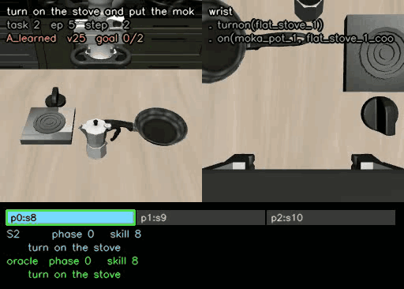 |
| task 2, episode 5, ground truth | 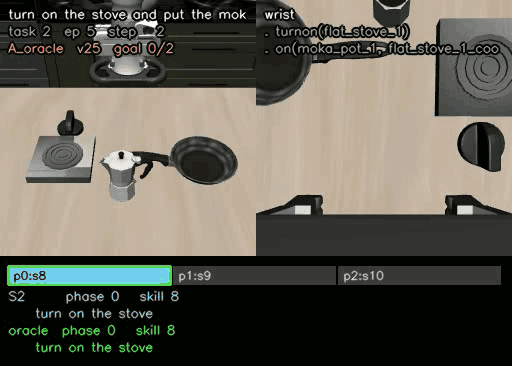 |

### Where the measurement misleads

Two clips where the per-episode agreement number is misleading rather than
wrong about the policy: task 8 (phase/skill merge means amber, not red, on a
failure) and task 5 (the oracle itself mislabels a thin book).

| clip | |
|---|---|
| task 8, episode 1 | 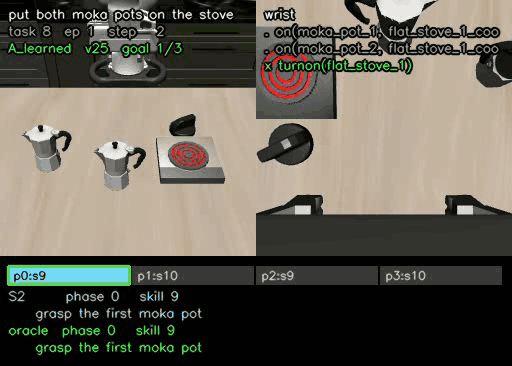 |
| task 5, episode 1 | 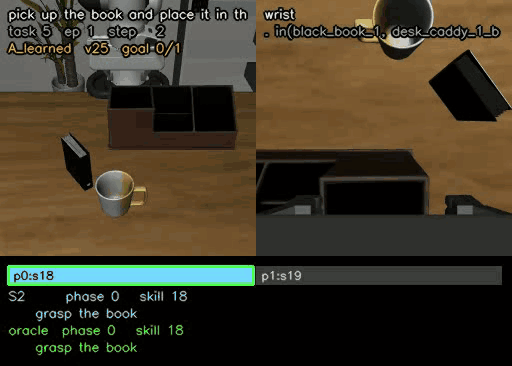 |

---

Each GIF's full per-step trace is in `outputs/videos/gifs/traces/`, alongside
the clip, in the schema `scripts/08_video.py` writes.
